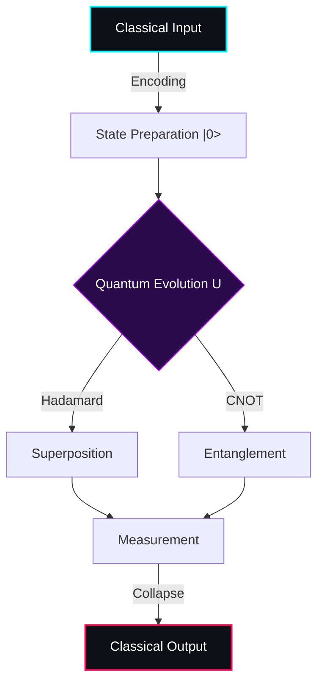

<div align="center">
  
<!-- <p align="center">
  
</p> -->


  <a href="https://git.io/typing-svg">
    
  </a>

  <p>
    
    
    
  </p>

</div>

<table>
  <tr>
    <td width="60%" valign="top">

### 🧬 The Hamiltonian (Who I Am)

I am an **M.Tech Quantum Computing** scholar at **DIAT, Pune**, bridging the gap between classical computer science and quantum information theory. My work focuses on **Quantum Metrology (Optical Lattice Clocks)**, **Algorithm Design**, and **Information Theoretic Security**.

> *"I don't just write code; I evolve unitary operators acting on the state space of information."*
<br />

### 🔭 Observable Operators (Current Focus)

- **$\hat{H}_{int}$**: Implementing **Shor’s & Grover’s Algorithms** in Qiskit.
- **$\rho_{sys}$**: Modeling **Open Quantum Systems** & Decoherence.
- **$|\Phi^+\rangle$**: Researching **Quantum Teleportation Protocols**.
- **$\mathcal{L}$**: Developing **Lattice-Based Cryptography** (Post-Quantum).

   </td>
    <td width="40%" valign="top">

<div align="center">
  


  <br/>
  
  
</div>

   </td>
  </tr>
  <td width="40%" valign="top">
  <div align="center">
    
    <br/>
    
    
  </div>
</td>
</table>

```math
|Ψ_{Agha}⟩ ∈ ℋ_{research}
```

```math
|Ψ_{Agha}⟩ = \alpha|Classical\_CS\_Dev\rangle + \beta|Quantum\_Researcher\rangle
```

---

## 🌌 Quantum Wavefunction: Current Focus Areas

```quantum-circuit
[ Qubit 0 ] --H-- [ Measure ] → Foundations & Linear Algebra
[ Qubit 1 ] --X-- [ CNOT ]  → Quantum Computing & Circuits
[ Qubit 2 ] --Z-- [ SWAP ]  → Quantum Information Theory
[ Qubit 3 ] --Y-- [ Phase ] → Quantum Communication & QKD
[ Qubit 4 ] --S-- [ Toffoli] → Post-Quantum Cryptography
[ Qubit 5 ] --T-- [ Bell ]  → Photonics & Nonlinear Optics
```

Passionately exploring **quantum information dynamics**—how qubits entangle for unbreakable security, exponential computation, and revolutionary tech. From Schrödinger's equations to Grover's search, I'm in superposition between theory and application.

---

## ⚛️ Quantum Toolkit: Operators & Observables

```text
Basis States    : Python | C/C++ | JavaScript
Eigenvectors    : NumPy | SciPy | Matplotlib | Jupyter
Hamiltonians    : LaTeX (Theorems, Simulations, Reports)
Decoherence Ctrl: Git | GitHub (Versioned Quantum Evolutions)
```

Treating quantum projects as **reproducible experiments**, not fleeting code. Every commit is a measurement collapsing possibilities into progress.

<p align="center">
  
  
  
</p>


---

## 🌀 Quantum Hilbert Space: Repository Architecture

```tree
Quantum-Multiverse/
├─ Dimension-I/     # Semester-I Wavepacket
│   ├─ Quantum-Mechanics/    # Dirac Notation & Operators
│   ├─ Quantum-Computing/    # Gates, Algorithms, Qubits
│   ├─ Quantum-Info-Theory/  # Entropy, Channels, No-Cloning
│   └─ Quantum-Tech-Lab/     # Hands-On Entanglements
├─ Dimension-II/    # Semester-II Interference
│   ├─ Quantum-Communication/ # Teleportation & Superdense Coding
│   ├─ Post-Quantum-Crypto/   # Lattice-Based Security
│   └─ Nonlinear-Optics/     # Photon Interactions & Squeezed States
└─ Research-Singularity/     # Black Hole of Innovations
    ├─ Simulations/          # Monte Carlo Quantum Walks
    ├─ Papers/               # Peer-Reviewed Wavefunctions
    └─ Experimental-Notes/   # Lab Decoherence Logs
```

Design philosophy: **Modular entanglement** for clarity, reproducibility, and scalable quantum extensions. Each repo is a basis vector in my research space.

---

## 🌟 Quantum Highlights: Selected Observables

**Quantum Realm Entanglements**
- **Circuit Simulations**: Implementing Shor's algorithm & variational quantum eigensolvers.
- **QKD Modeling**: Simulating free-space quantum key distribution with atmospheric noise, photon loss, and entanglement distribution.
- **LaTeX Mastery**: Crafting publication-ready reports on quantum error correction and topological qubits.

**Classical Echoes (Pre-Collapse)**
- Blockchain oracles & Ethereum smart contracts.
- Secure Python backends with cryptographic primitives.
- Algorithmic tools bridging classical to quantum paradigms.

*(Classical roots stabilize my quantum superposition.)*

<p align="center">
  
</p>

---

## 🚀 Quantum Trajectory: Research Horizon

```quantum-evolution
Initial State |Ψ(0)⟩ → MTech Foundations
Unitary U(t)         → PhD in Quantum Tech
Measurement          → Theory + Simulation + Comm Systems
Collapse Principle   → Depth ≫ Speed, Clarity > Hype
```

Aiming for **sustained quantum advantage** in long-term research, not transient demos. Entangling academia with industry for fault-tolerant futures.

---

### ⚛️ Circuit Representation: My Workflow



## 🔗 Quantum Links: Entangle With Me

```text
Quantum Letter    : cs.aghasyedi@gmail.com
LinkedIn Portal   : https://www.linkedin.com/in/aghasyedi/
X Beam            : https://twitter.com/SyediAgha
GitHub Hole       : https://github.com/aghasyedi/
```

---

<p align="center">
  <i>“In the quantum realm, reality is a superposition—until observed. Let's collapse some wavefunctions together.”</i> 🔬
</p>

<div align="center">

  


</div>
